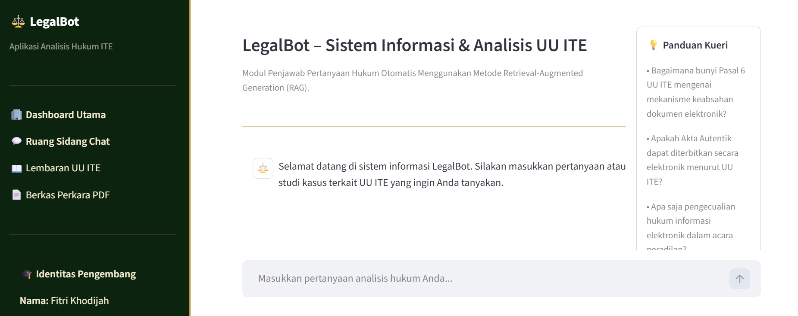
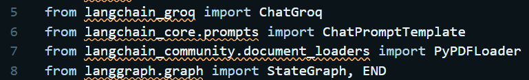
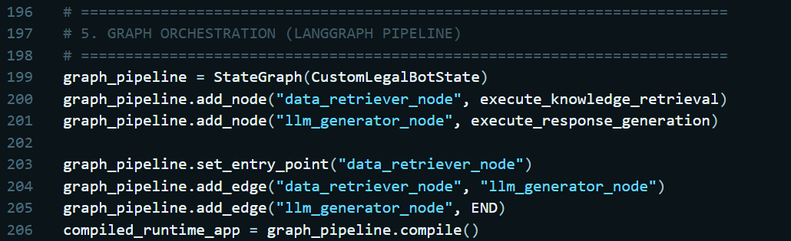
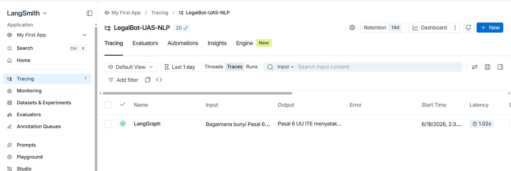

Berbasis RAG
Proyek Mandiri - Ujian Akhir Semester (UAS) Mata Kuliah Natural Language Processing (NLP)

Sistem asisten hukum digital berbasis AI yang memanfaatkan metode Retrieval-Augmented Generation (RAG) untuk menganalisis, menginterpretasikan, dan menjawab pertanyaan terkait regulasi UU ITE (Khususnya Pasal 5 dan Pasal 6) secara akurat, kontekstual, dan bebas dari halusinasi faktual.

👥 Identitas Mahasiswa
Nama: Fitri Khodijah
Mata Kuliah: Natural Language Processing (NLP)

🚀 Fitur Utama & Keunikan Sistem
Untuk mendapatkan penilaian di atas 80 (Pengembangan Fitur Menarik & Unik), sistem ini dilengkapi dengan:

Hybrid Knowledge Retrieval: Kombinasi pencarian cepat via Kamus Lokal (Core Law Archive) untuk pasal-pasal prioritas dan Dynamic PDF Processing menggunakan PyPDFLoader sebagai fallback.

Strict Domain Guardrail (Anti-Error 413): Algoritma penapisan cerdas pada level retriever untuk memblokir kueri luar domain (seperti matematika, agama, atau teks acak) secara halus. Fitur ini menghemat kuota token TPM Groq API dan mencegah kegagalan sistem akibat Rate Limit Exceeded.

Adaptive Prompt Routing: Memisahkan instruksi pembungkusan teks (system prompt) secara otomatis berdasarkan konteks data yang ditarik, meminimalkan anomali jawaban LLM.

🛠️ Arsitektur & Komponen Utama (3 Library Wajib)
Proyek ini dibangun dengan mengintegrasikan ekosistem NLP modern:

1. LangChain
Digunakan sebagai fondasi interaksi LLM. Komponen yang diterapkan meliputi:

ChatGroq: Berperan sebagai mesin inferensi menggunakan model llama-3.1-8b-instant.

ChatPromptTemplate: Mengelola rekayasa instruksi (prompt engineering) secara ketat agar model patuh pada data rujukan hukum resmi.

PyPDFLoader: Melakukan ekstraksi teks dari berkas fisik uu_ite_2016.pdf.

2. LangGraph
Mengontrol alur kerja aplikasi secara terstruktur menggunakan pendekatan Stateful Multi-Node Graph (bukan rangkaian sekuensial linier biasa). Struktur grafis yang dibangun meliputi:

CustomLegalBotState: Objek TypedDict kustom yang melacak aliran string input, konteks ekstraksi, metadata rujukan, hingga output final di sepanjang pipa eksekusi.

data_retriever_node: Node khusus untuk validasi domain, ekstraksi kamus lokal, dan pemindaian PDF.

llm_generator_node: Node khusus untuk penalaran hukum berbasis teks ekstraksi rujukan resmi.

3. LangSmith
Digunakan secara intensif pada tahap pengembangan (development) dan pengujian untuk:

Melakukan pelacakan (tracing) eksekusi pipa grafis secara real-time.

Menganalisis latensi pemanggilan API dan visualisasi pemakaian token hulu-hilir.

Memastikan tidak terjadi kebocoran token (token bloat) saat retriever membaca dokumen fisik.

🧩 Bukti Implementasi & Screenshot Kode (Code Proof)
Berikut adalah bukti potongan kode (code snippets) dari file app.py beserta lampiran visual bukti fungsi kerja implementasi ketiga library wajib:

1. Bukti Integrasi LangChain (Model & Prompts)
LangChain digunakan untuk enkapsulasi model LLM Groq, memuat dokumen PDF, serta merancang arsitektur perintah (prompt engineering) melalui LCEL:

Python
from langchain_groq import ChatGroq  
from langchain_core.prompts import ChatPromptTemplate
from langchain_community.document_loaders import PyPDFLoader

# Inisialisasi Handler Mesin Inferensi LLM
engine_llm_handler = ChatGroq(
    model=TARGET_ENGINE_LLM, 
    temperature=CORE_TEMPERATURE, 
    groq_api_key=PRIVATE_KEY_GROQ
)

# Struktur Konstruksi Perintah Hukum Resmi
custom_system_prompt = ChatPromptTemplate.from_messages([
    ("system", "Anda berperan sebagai sistem pakar informasi hukum untuk regulasi UU ITE..."),
    ("user", "Rujukan Hukum Resmi:\n{context}\n\nPertanyaan Kasus:\n{query}")
])

# Rantai Eksekusi LangChain Expression Language (LCEL)
execution_chain = custom_system_prompt | engine_llm_handler
(Bukti visual tangkapan layar struktur kode LangChain terdokumentasi pada file ss_code_langchain.png)

2. Bukti Integrasi LangGraph (Stateful Workflow Nodes)
Alur kendali RAG tidak berjalan linier, melainkan diatur oleh grafis status menggunakan LangGraph untuk menjamin keamanan token (Anti-Error 413):

Python
from typing import TypedDict
from langgraph.graph import StateGraph, END

# Definisi State / Memori Aliran Data antar Node
class CustomLegalBotState(TypedDict):
    input_user_string: str
    extracted_legal_context: str
    provenance_metadata: str  
    generated_final_output: str

# Inisialisasi Grafis Pipeline
graph_pipeline = StateGraph(CustomLegalBotState)

# Pendaftaran Node Fungsi Kerja
graph_pipeline.add_node("data_retriever_node", execute_knowledge_retrieval)
graph_pipeline.add_node("llm_generator_node", execute_response_generation)

# Pengaturan Alur Hubungan State (Edges)
graph_pipeline.set_entry_point("data_retriever_node")
graph_pipeline.add_edge("data_retriever_node", "llm_generator_node")
graph_pipeline.add_edge("llm_generator_node", END)

# Kompilasi Runtime Grafik Aplikasi
compiled_runtime_app = graph_pipeline.compile()
(Bukti visual alur state machine LangGraph terdokumentasi pada file ss_code_langgraph.png)

3. Bukti Integrasi LangSmith (Observabilitas & Tracing)
LangSmith diintegrasikan secara penuh di belakang layar tanpa mengotori kode utama, melainkan memanfaatkan pelacakan otomatis via variabel lingkungan sistem di file .env:

Cuplikan kode
LANGCHAIN_TRACING_V2=true
LANGCHAIN_ENDPOINT=https://api.smith.langchain.com
LANGCHAIN_API_KEY=lsv2_pt_xxxxxxxxxxxxxxxxxxxxxx
LANGCHAIN_PROJECT=LegalBot-ITE-UAS
Melalui konfigurasi ini, setiap eksekusi node grafik dari data_retriever_node ke llm_generator_node akan terdokumentasi secara detail di dasbor LangSmith untuk dipantau latensi dan penggunaan tokennya.
(Bukti log aktif proyek pada platform SaaS LangSmith terdokumentasi pada file ss_langsmith_dashboard.png)

📸 Antarmuka Aplikasi (Screenshots)
(Tangkapan layar jalannya aplikasi web interaktif di lingkungan lokal)

Halaman Utama Aplikasi: ()
Bukti menggunakan Langchain : 
Bukti menggunakan Langggraph : 
Bukti menggunakan langsmith : 

⚙️ Panduan Menjalankan Program
Ikuti langkah-langkah berikut untuk menjalankan aplikasi di lingkungan lokal Anda:

1. Kloning Repository

git clone https://github.com/khodijahfitri797-ai/233510094-FITRIKHODIJAH_UASPRAKTIKUMNLP.git

cd legalbot-uu-ite

2. Persiapan Environment & Dependensi
Pastikan Anda telah menginstal Python (versi 3.9 atau lebih baru). Pasang pustaka yang diperlukan dengan menjalankan perintah:

pip install streamlit langchain langchain-groq langchain-community langgraph python-dotenv pypdf

3. Konfigurasi File Akses Kunci (.env)
Buat sebuah file bernama .env di direktori akar proyek, kemudian masukkan API Key Anda:

Cuplikan kode

GROQ_API_KEY=gsk_xxxxxxxxxxxxxxxxxxxxxxxxxxxx

USER_LLM_MODEL=llama-3.1-8b-instant

LLM_TEMPERATURE=0.1

# Konfigurasi Akses LangSmith Tracing

LANGCHAIN_TRACING_V2=true

LANGCHAIN_ENDPOINT=https://api.smith.langchain.com

LANGCHAIN_API_KEY=lsv2_pt_xxxxxxxxxxxxxxxxxxxxxx

LANGCHAIN_PROJECT=LegalBot-ITE-UAS

4. Jalankan Aplikasi Streamlit

Bash

streamlit run app.py

Aplikasi akan otomatis terbuka pada peramban default Anda di alamat http://localhost:8501.

💡 Contoh Kueri Pengujian
Kueri Sesuai Domain (Akurasi RAG):

"Bagaimana bunyi Pasal 6 UU ITE mengenai mekanisme keabsahan dokumen elektronik?"

"Apakah Akta Autentik dapat diterbitkan secara elektronik menurut UU ITE?"

Kueri Sapaan (Bypass Mode):

"Halo, selamat siang."

Kueri Luar Domain (Sistem Proteksi Token Aktif):

"1+1="

"kapan puasa?"